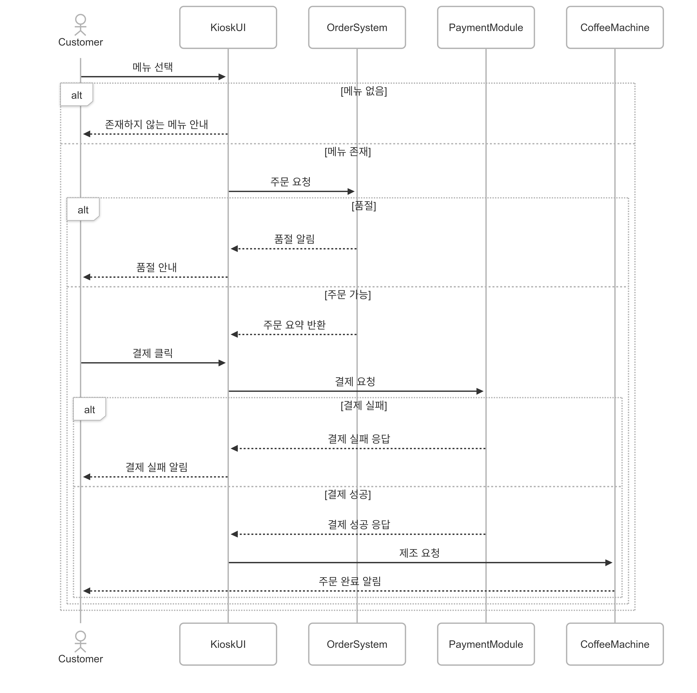

# 소프트웨어공학(월 123) 개인 실습 과제 1  
성명 : 권도연  
학번 : 20231380  
학과 : 컴퓨터공학과    

# 무인 카페 키오스크 주문 시스템
본 프로젝트는 '일상 속 소프트웨어 활용 사례'를 바탕으로,   
무인 카페 키오스크의 주문 프로세스를 시퀀스 다이어그램으로 구조화하고,  
해당 흐름을 기반으로 파이썬 코드로 구현한 개인 실습 과제입니다.  

# ⓐ 시퀀스 다이어그램 (Mermaid)
아래 시퀀스 다이어그램은 사용자가 키오스크에서 음료를 주문할 때의 전체 흐름을 표현합니다.  
메뉴 선택부터 결제, 제조까지의 절차와 각 예외 상황(메뉴 없음, 품절, 결제 실패 등)을 조건 분기로 세분화하였습니다.  

<pre> <code>
mermaid
sequenceDiagram
    actor Customer
    participant KioskUI
    participant OrderSystem
    participant PaymentModule
    participant CoffeeMachine

    Customer ->> KioskUI: 메뉴 선택

    alt 메뉴 없음
        KioskUI -->> Customer: 존재하지 않는 메뉴 안내
    else 메뉴 존재
        KioskUI ->> OrderSystem: 주문 요청

        alt 품절
            OrderSystem -->> KioskUI: 품절 알림
            KioskUI -->> Customer: 품절 안내
        else 주문 가능
            OrderSystem -->> KioskUI: 주문 요약 반환
            Customer ->> KioskUI: 결제 클릭
            KioskUI ->> PaymentModule: 결제 요청

            alt 결제 실패
                PaymentModule -->> KioskUI: 결제 실패 응답
                KioskUI -->> Customer: 결제 실패 알림
            else 결제 성공
                PaymentModule -->> KioskUI: 결제 성공 응답
                KioskUI ->> CoffeeMachine: 제조 요청
                CoffeeMachine -->> Customer: 주문 완료 알림
            end
        end
    end
</code> </pre>
    

# ⓑ 샘플 코드 설명
본 프로젝트의 kiosk.py 파일은 위 시퀀스 다이어그램의 흐름을 바탕으로 실제 동작 가능한 Python 코드로 구현되었습니다.  

주요 구현 내용 :  
-Menu : 음료 목록과 재고 상태를 관리  
-OrderSystem : 주문 생성과 주문번호 발급 처리  
-PaymentModule : 결제 시도 및 결과 반환 (성공/실패 랜덤 처리)  
-CoffeeMachine : 음료 제조 시뮬레이션  
-KioskUI : 사용자와 시스템의 중재자 역할 수행  
  
특히 사용자가 입력 기반 흐름을 통해 다양한 시나리오(없는 메뉴 입력, 품절, 결제 실패 등)를 테스트할 수 있도록 설계했습니다.    
추가적으로 실제 키오스크 시스템 흐름을 반영하기 위해, 주문번호를 랜덤하게 부여하는 주문번호 생성 로직을 작성했습니다.

# ⓒ 모듈 평가 결과 (응집도 / 결합도 중심)
[응집도 분석]  
각 클래스는 자신의 책임을 명확히 수행하도록 분리되어 있어 응집도가 높습니다.  
  
-Menu : 메뉴 재고 정보 제공 전담  
-OrderSystem : 주문 생성, 요약 및 번호 부여 기능 집중  
-PaymentModule : 결제 처리에만 관여  
-CoffeeMachine : 제조 기능만 수행  
-KioskUI : 전체 흐름 제어, 사용자 상호작용 처리  
  
모든 클래스가 하나의 주된 기능만 수행하며, 불필요한 책임이 분산되지 않아  
단일 책임 원칙(SRP: Single Responsibility Principle)에 부합합니다.  
-> 응집도 수준 : 높음  

[결합도 분석]  
전체 시스템은 '낮은 결합도(Low Coupling)를 유지하고 있습니다.  
KiosUI를 중심으로 각 기능 모듈이 독립적으로 연결되며, 클래스 간 직접적인 호출은 없습니다.  
  
-각 모듈은 생성자 주입 방식으로 구성되어 유연성과 테스트 편의성을 갖추고 있음  
-특정 모듈(PaymentModule, CoffeeMachine) 변경 시에도 다른 모듈에 영향을 주지 않음  
-기능 확장 시 최소한의 수정으로 대체 가능  
  
이러한 구조는 변경에 유연하고 유지보수가 쉬운 구조적 장점을 제공합니다.  
-> 결합도 수준 : 낮음  

# 종합 평가
이번 프로젝트에서는 무인 카페 키오스크라는 친숙한 일상 속 소프트웨어 시스템을 선정하여, 객체지향적 관점에서 전체 흐름을 분석하고, 이를 시각적으로 모델링한 뒤 실제 동작 가능한 코드로 구현하였습니다. 각 구성 요소는 기능별로 명확히 분리되어 있어 높은 응집도를 갖추었으며, 전체 흐름은 중재자 역할을 하는 kioskUI를 중심으로 효과적으로 제어되도록 설계하였습니다. 또한, 메뉴 오류 입력, 품절, 결제 실패 등 현실적인 예외 상황을 반영하여 다양한 시나리오를 시뮬레이션할 수 있도록 구현하였습니다. 전체적으로 모듈 간 결합도는 낮고, 재사용성과 유지보수 용이성이 확보되어 있어 코드와 다이어그램 모두 높은 완성도를 보였다고 판단하였습니다.   

# 실행 방법
1. Python 3.x 환경에서 kiosk.py 파일 실행  
2. 아메리카노 / 라떼 / 모카 중 메뉴 입력  
3. 품절, 결제 실패 등 다양한 흐름 자동 시뮬레이션  
4. exit 입력 시 종료  

# 폴더 구조
kiosk-order-system  
├── README.md                  # 설명서  
├── kiosk.py                  # 샘플 코드  
├── sequence_diagram.mmd      # Mermaid 원본 다이어그램  
├── sequence_diagram.png      # 시각화된 다이어그램 이미지  

